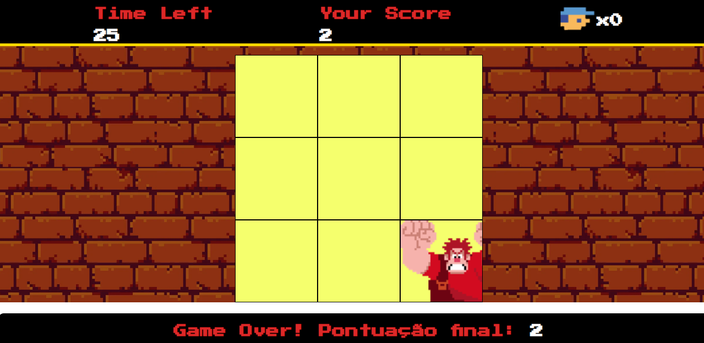

# PROJETOS FRONTEND 

## > Detona Ralph game 
Uma emocionante experiência onde os jogadores testam sua rapidez e precisão ao clicar em blocos que aparecem aleatoriamente na tela. O objetivo é clicar nos blocos certos, representados por "inimigos", para marcar pontos, enquanto evitam clicar nos blocos vazios, que resultam na perda de vidas.
Os jogadores devem ser rápidos e precisos, pois o tempo é limitado e a cada erro, uma vida é perdida. O desafio aumenta conforme o tempo passa, mantendo o jogador envolvido e motivado a melhorar suas habilidades.

## > Jogo da Memória
Este é um jogo da memória onde o jogador combina pares de cartas iguais, usando concentração e memorização. Com uma interface visual cativante e cores vibrantes, o jogo desafia a memória e atenção do jogador, sendo divertido para todas as idades.

### Vídeo Demonstrativo
[![Vídeo do Jogo da Memória]](MemoryGame/src/video/videojogodamem.mp4)

### > Lista de Tarefas
Uma aplicação simples e interativa onde os usuários podem gerenciar suas tarefas diárias de forma eficiente. Com uma interface intuitiva, é possível adicionar, editar, remover e limpar tarefas, mantendo a organização com facilidade.  

> **Adicionar Tarefa**  
Os usuários podem inserir novas tarefas, que são exibidas automaticamente na lista.   
> **Remover Tarefa**  
Cada tarefa possui um botão de remoção, permitindo excluir itens individualmente.  
 
> **Editar Tarefa**  
É possível modificar uma tarefa já existente por meio de um prompt, facilitando ajustes rápidos.  

> **Limpar Lista**  
Um botão dedicado permite apagar todas as tarefas de uma vez, reiniciando a lista.  

